# Game Design Document (GDD)

### Table of contents
* [Game Overview](#game-overview)
* [Story and Narrative](#story-and-narrative)
* [Gameplay and Mechanics](#gameplay-and-mechanics)
* [Levels and World Design](#levels-and-world-design)
* [Art and Audio](#art-and-audio)
* [User Interface (UI)](#user-interface-ui)
* [Technology and Tools](#technology-and-tools)
* [Team Communication, Timelines and Task Assignment](#team-communication-timelines-and-task-assignment)
* [Possible Challenges](#possible-challenges)

### Game Overview

**Core Concept**

In Distress! At the Disco, you play as Echo Rhythmberg, a seasoned rave goer, who has to fight off hordes of dancers who are being controlled by the music of an evil DJ, DJ Mindmangler. Distress! At the Disco is a rhythm-based action shooter survival game in which the player must stay on beat with their actions to get stronger and defeat DJ Mindmangler and the other dancers.

The core gameplay loop involves fighting off waves of enemies whilst syncing up your actions to the beat of the song. Defeating enemies and staying on beat will make the player stronger, allowing them to take down tougher enemies. 

**Genre**

Distress! At the Disco is a Survival and Rhythm Game. It is inspired by the game BPM which also has a similar concept of shooting based on the beats.	

**Target Audience**

The target audience of the game would be a mix of two primary groups of people which are players who enjoy First Person Shooters and players who are musically inclined or rhythm gamers.

**Unique Selling Point**

Distress! At the Disco fast paced rhythm based combat mechanics is the biggest point of difference for our game. Players will enjoy the flow of the game, as well as be challenged by the pace and difficulty. There are not many games that can be found which combine the aspect of a survival shooter with an on beat rhythm game. The game will be able to teach players a sense of rhythm and tempo while also subverting their attention to other things occurring in the game. This can be useful for people who want to learn different time signatures and tempos.

### Story and Narrative

**Backstory**

Echo Rhythmberg is on their way to go see the hottest new DJ in town, DJ Mindmangler. Apparently once you hear his music, you can’t stop dancing. Sounds like a blast! As Echo is approaching the venue, they start to hear a deafening high frequency sound. It starts to give Echo a headache, so to drown it out, Echo puts on their helmet and starts to play some music. Coming up to the doors, Echo notices that no one else is around. “Everyone must be inside already” they think. Weird. It’s only when Echo opens the doors that they figure out what's going on. Everyone is spaced out evenly on the dance floor, all moving in sync. They look like they’re in a trance. Echo starts to move up to the front to get a better look at what is going on.

As Echo approaches the front, DJ Mindmangler notices Echo not moving in sync with everyone else. He quickly picks up on the fact that Echo’s helmet is protecting them from the mind controlling music he is playing. He can’t have this, and so he changes up his track to switch the focus of all the dancers from him to Echo. Mindmangler points at Echo and shouts to his fans, “Get that helmet off them now!”. All of the dancers start running towards Echo. How will they survive?

**Characters**

_Echo Rhythmberg_

A seasoned rave goer with a signature rave helmet. Echo has an incredible talent of instantly picking up the beat of any song they listen to. Echo is a bright and outgoing character, who loves nothing more than a dance.

  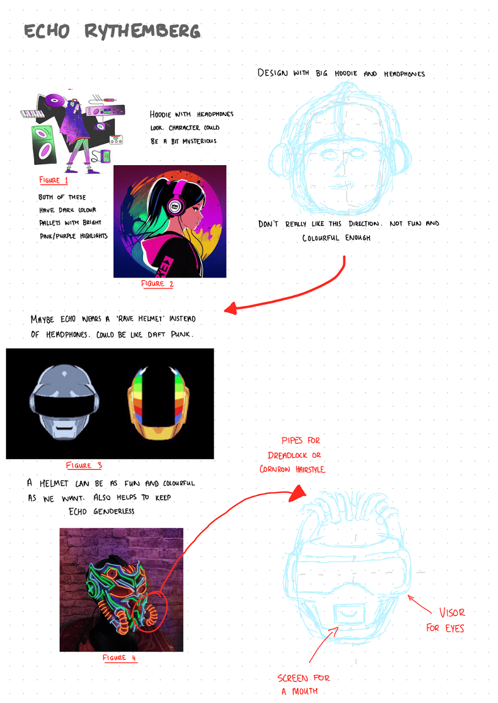

  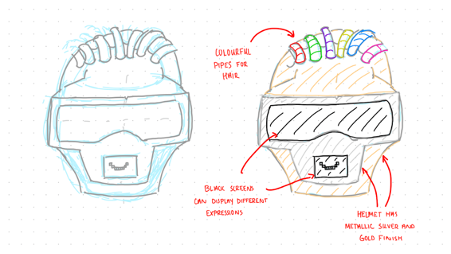

Figure 1: https://dribbble.com/shots/11123743-Characters-in-context-Club 

Figure 2: https://www.google.com.au/imgres?imgurl=https%3A%2F%2Fimage.civitai.com%2FxG1nkqKTMzGDvpLrqFT7WA%2Fd62c63dd-6dc9-4e53-3ad9-545297c4e600%2Fwidth%3D512%2F03680-2335156476-ink%2520art%2C%2520vector%2C%2520girl%2520wearing%2520a%2520hoodie%2520and%2520headphones%2C%2520colorful%2520background%2C%2520highly%2520detailed%2C%2520photo%2520from%2520side%2C%2520music%2520album%2520cover%2C.jpeg&tbnid=jy_51lHi0I_2lM&vet=1&imgrefurl=https%3A%2F%2Fcivitai.com%2Fimages%2F75414%3FmodelId%3D4912&postId%3D59204&id%3D4912&docid=btCEGdqa-JzJzM&w=512&h=512&itg=1&hl=en-au&source=sh%2Fx%2Fim%2F1 

Figure 3: https://www.reddit.com/r/PixelArt/comments/gsikuy/oc_daft_punk_helmets/ 

Figure 4: https://www.etsy.com/au/listing/1273884800/cyborg-shogun-mask-light?click_key=3c096d821af54b5744f2076c0f9232532bdae92c%3A1273884800&click_sum=640d35f5&ref=market_rv-1 

_DJ Mindmangler_

The hottest new DJ on the scene. When his music wasn’t taking off, he experimented with some industrial sounds. After combining some high frequency sounds with some ‘machinery music’, Mindmangler stumbled onto the realisation that he could control his listeners minds with this weird blend of music. After coming to terms with his new power, Mindmangler set off on a path of evil. All he ever wanted was for people to listen to his music, but now, people can’t do anything else but listen to his music.

  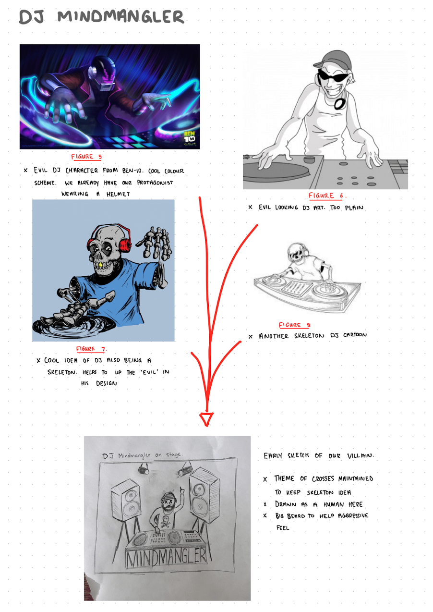

  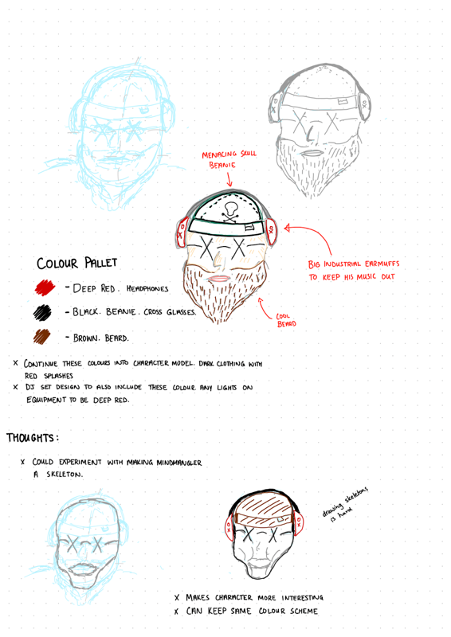

Figure 5: https://www.artstation.com/artwork/KawxgW 

Figure 6: https://dontstopusnow.co/tag/evil-dj/ 

Figure 7: https://www.deviantart.com/fmelihy/art/Skeleton-Dj-704145606 

Figure 8: https://coloringonly.com/category/miscellaneous/dj/dj-skeleton-coloring-page/ 

_Enemies (Dancers)_

  Figure 9 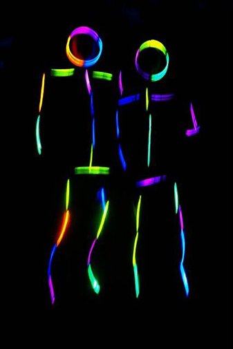
  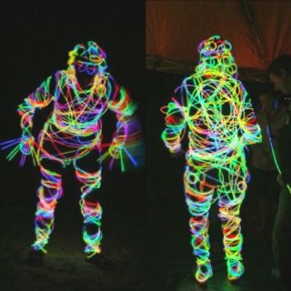 Figure 10

Figure 9: https://www.pinterest.com.au/pin/135248795047149008/  

Figure 10: https://www.pinterest.com.au/pin/3940718393881132/ 

The enemies that come towards the play will be humans in glow stick costumes. Glow sticks and neon lights are a common theme at discos and raves, so having the dancers dressed like this will make sense.

We could make each enemy spawned have a different pattern of glowsticks, making each enemy somewhat unique. Additionally, this design is fun, but also simple enough to not make each enemy feel overly important. It helps to bring the collection of mindless enemies together to form one big group.

They could look either like the ones on the left or right. Possibly lower tier enemies have a body made up of less glow sticks, whereas a higher tier enemy has a body made up of more glow sticks. The amount of glow sticks could signify their strength

### Gameplay and Mechanics

**Player Perspective**

Distress! At the Disco will be a first person shooter. First person was selected over the more artistic third person because of its gameplay benefits for a shooter game. Being in first person allows the game to have more precise shooting mechanics, while also possibly raising the difficulty as well. 

Below is an image of a Doom remake in Unity. Distress! At the Disco will have a similar perspective to this.

  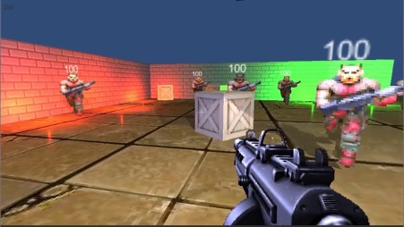

  Figure 11

**Controls**

Movements will be WASD and aiming with the mouse. Left click to shoot.
Potential abilities into the mix (Such as an ultimate) or other items as you level up (Might just be passive abilities that occur automatically)

  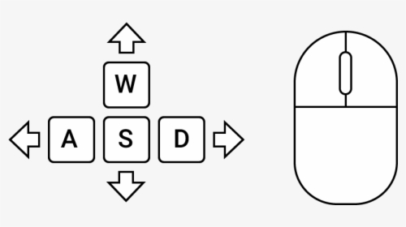

  Figure 12

**Progression**

One survival round will last 5 minutes, and the round will get progressively more difficult such as the Beat per Minute increases and the enemies are more difficult to kill. For now the increment of difficulty occurs every minute, with the last minute being a Boss fight.

  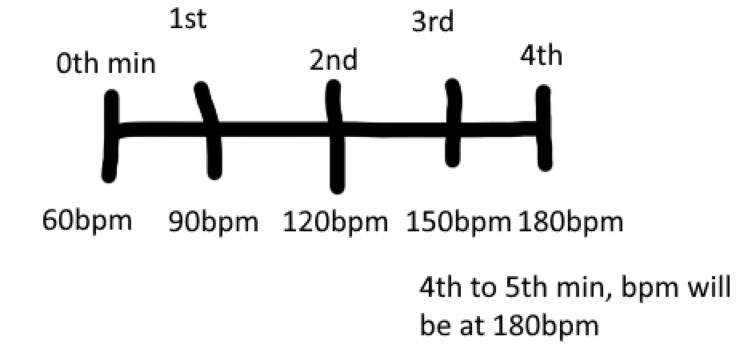

  Figure 13

**Gameplay Mechanics**

1. Beat per minute(BPM)
    * Players choose the number of BPM to play the game, the higher the BPM the harder the game.

2. Crosshair
    * Players have a crosshair on their screen that indicates where the weapon is aimed.

3. Beat Matching
    * Players control weapons on the screen, and their objective is to match their actions with the prompts around the crosshair. They do this by tapping, clicking, or pressing buttons in time with the music.

  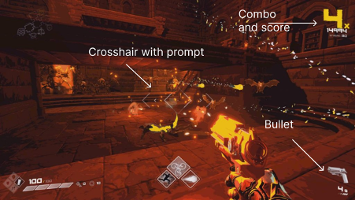

  Figure 14

Screenshot from following video. Elements of Auditory and Visual Feedback are seen in this video when the player clicks on beat.
https://www.youtube.com/watch?v=rUGhf0y9bWQ&t=489s 

4. Scoring System 
    * The game employs a scoring system that rewards players for accurate beat matching. Perfectly timed actions yield better damage and do not consume the bullet encouraging precision and timing.

5. Combo System
    * Successfully hitting multiple consecutive prompts in a row without missing grants players combo multipliers, further increasing damage. Missing a combo will lose all the multipliers.

6. Visual Feedback
    * When players correctly match a beat, the weapon explodes in a burst of color and light, accompanied by a musical note. This provides immediate visual feedback.

7. Auditory Feedback
    * The game generates auditory feedback, including music and sound effects that are tightly synchronized with the music. Missed beats or inaccurate actions result in audible cues.
8. Enemy
    * Action bar: each beat enemy can perform 1 action, when the bar is full of beat execute an attack toward player
    * Wave: enemy will appear in wave and always aggro to player
    * Movement: enemy will move on certain beat
    * State:
        * _Charge_: if player in enemy attack range, it starts to charge, the longer the stronger
        * _Attack_: When the beat bar is full, shoot a bullet to player and deal damage based on charge time
        * _Move_: aggro player and move toward them

### Levels and World Design 

**Game World**

The game world setting will be in a disco with tiled floors. It will be set in a 3D world with one single level. The Camera would be moving with the player for the feel of we are the player, in the game.

The game will be a 5 minute survival, and the level of difficulty will increase over time. Since the game is a confined space, the small area will not require a minimap.

**Objects**

Obstacles such as speakers and furniture are some of the objects that hinder the movements of the player in the setting. Enemies will be other objects that move towards and attack the player. They will be 2d images which are constantly facing the player, using a technique called billboarding. 

Below is a screenshot of a youtube video highlighting this effect in a game called Fallen Aces. The world that the player is in is 3d, along with the world objects. However, the enemies coming towards them are 2d.

  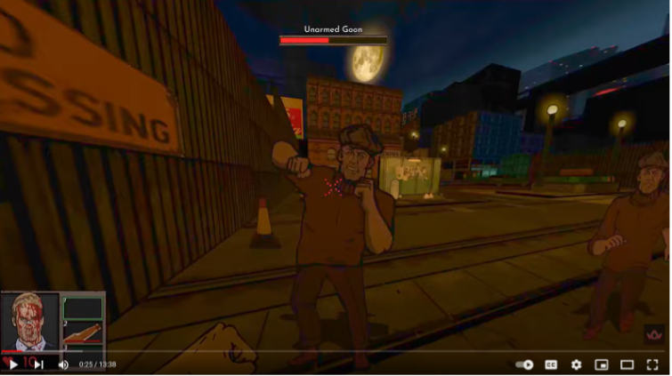

  Figure 15: https://www.youtube.com/watch?v=drm-rFh37D4 

**Physics**

Players will be damaged when colliding with enemies. Enemies are made of rigid bodies that cannot pass through one another. Enemies' movement follows beats and movement results in small glides across the floors from tile to tile.

  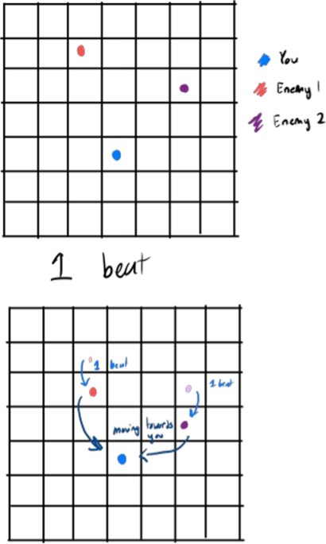

  Figure 16

### Art and Audio

**Art Style**

We are going with a minimalistic style with neon lighting, the aesthetic of the game would be a simplistic yet futuristic design. For a dimly lit room, neon lighting would be very suitable to have especially for a setting like a disco or club environment. 

  Figure 17 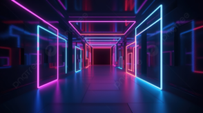
  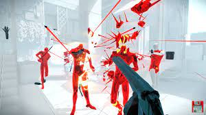 Figure 18

Figure 17: https://pngtree.com/freebackground/neon-light-nightclub-interior-abstract-inner-space-in-shades-of-blue-pink-and-violet_3708893.html

Figure 18: https://www.newgamenetwork.com/media/28981/superhot-mind-control-delete/

**Sound and Music**

For the music in the game, it would be an upbeat song, typically found in discos, and they will progressively get faster and faster in accordance to the game progression which is typically a normal progression for songs which start off slow and pick up at the chorus. 
https://www.youtube.com/watch?v=OKNoh27nBhE&list=RDQMbpvpi-ymFog&index=14

The sounds in the game would be from weapons and attacks, and the sounds created would be instrumental sounds. Such as if the weapon was a guitar, the sounds would be a guitar strum, or if its drums, they would be drum snares.
https://www.youtube.com/watch?v=abXr0O-IB88

**Assets**

Some assets made for the music notes which will be part of the UI design to signify each beat are polygonized through an online image to polygon generator.

  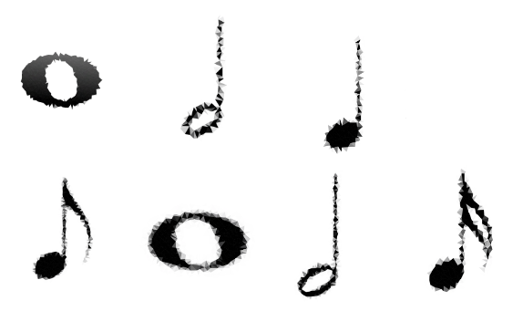

  Figure 19

Figure 19: https://codepen.io/EvanLevesque/pen/ObgOaV

  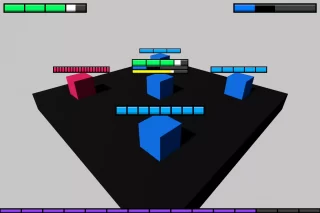

  Figure 20

Figure 20: https://unityassets4free.com/minimalist-bar-system-2/

### User Interface (UI)

This will be the user interface when the user first enter our page.

  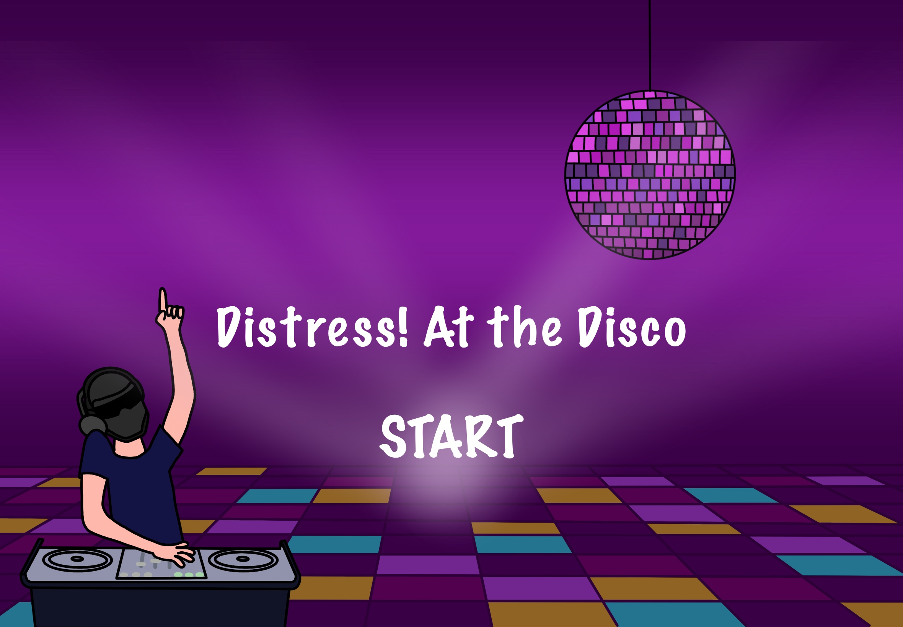

  Figure 21

This will be the user point of view when they are playing the game.

  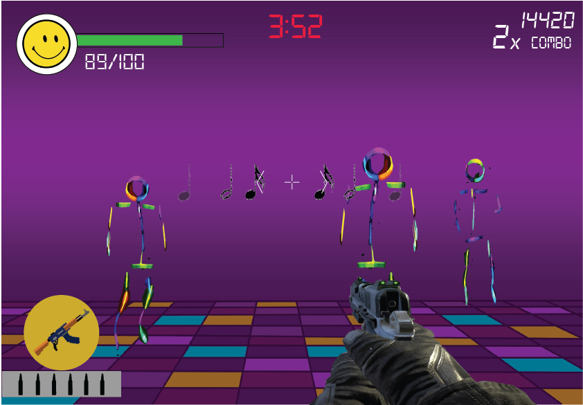

  Figure 22

This is will be the user interface when the user meet the final boss at the end. 

  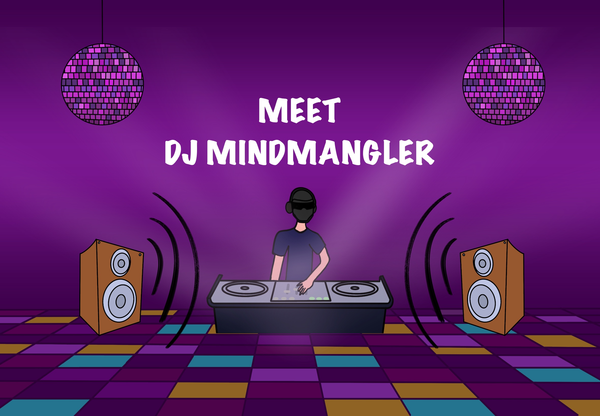

  Figure 23

### Technology and Tools

For technology used, we are using Github as a repository to store our code and assets because it is a cloud-based service. This means the code that is saved on the repository can be accessed by other team members. This is also because github provides version control, thus being able to backtrack to an earlier version if necessary. The game will be running on the Unity Engine, using the programming language, C#. This is what is being taught in classes and will be used in the development of the game. For the User Interface session, we have used designing tools such as Procreate and Adobe AI for the drawings.

We have used some online services such as an image to polygon generator, which can be found at https://codepen.io/EvanLevesque/pen/ObgOaV . This is one of the avenues which can help asset creation.

### Team Communication, Timelines and Task Assignment

**Team Communication**

For general team communication, we are primarily using Facebook messenger as an easy and quick way to communicate. For more formal ideals, we share a Google Document where we can write down ideas to be reviewed by other team members at a later time. 
Additionally, we are using Monday.com as an overall project manager and communication avenue. Monday.com will be used in a much more formal manner than Facebook messenger. 

**Timelines**

|                     Milestones                    |              Date             |
| ------------------------------------------------- | ------------------------------| 
| First prototype complete.                      | Friday the 1st of September   | 
| Early stages of game design.                   | Friday the 29th of September  | 
| Conduct first playtesting.                     | Friday the 15th of September  | 
| Review playtesting, conduct more playtesting.  | Friday the 29th of September  | 
| Finalize design.                               | Friday the 13th of October    | 
| Polish game.                                   | Friday the 20th of October    | 
| Review and last adjustments.                   | Sunday the 29th of October    | 

**Task Assignment**

To keep everyone up to date with the progress of the game, we have decided to use ‘Monday’, which is a work management system where group members can update on their own personal progress and other members can keep track of what needs to be done. This is a more formal platform compared to Facebook Messenger.

### Possible Challenges

Our biggest challenge is our overall lack of game making skill and asset creation skill. No member in our group has any experience with either. Lack of game making skill is not necessarily a major issue, as we will learn techniques throughout the class, and gain knowledge as we build our game. The lack of creative skills might be a bigger problem. This creates the problem of not being able to obtain the exact assets we want, such as character models or world design. For this, we will either have to:
- Commission the creation of assets to our specification
- Make do with the best free assets we can find
- Learn the creation skills ourselves. This will use up time we could be spending on the game itself. 

The same issue heavily applies to the sound design of our game. Being a rhythm game, music and sound design is a crucial part of the overall game. For this, we can either resort to royalty free music and sound, or commission the creation of our music. 

One other possible area of challenge will be aligning our busy schedules to find time to meet. However, with good communication this should not be very hard to solve. 

To keep everyone up to date with the progress of the game, we have decided to use ‘Monday’, which is a work management system where group members can update on their own personal progress and other members can keep track of what needs to be done.
